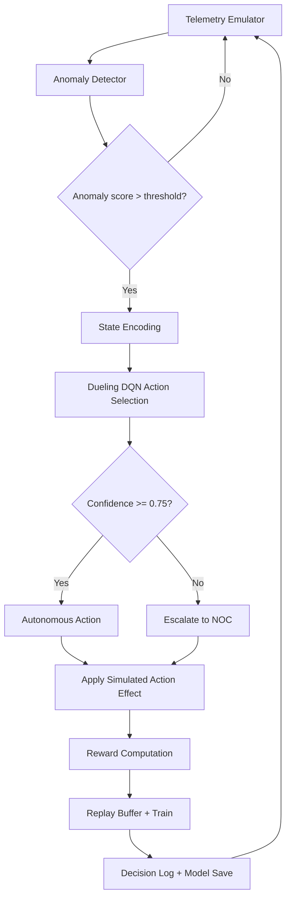
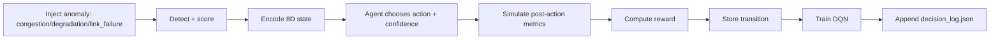

# NeuroNet Modulator (MVP)

GPU-accelerated reinforcement-learning prototype for self-healing network operations.

## Original Idea

Traditional network operations are mostly reactive and manual: alerts fire after service quality drops, operators investigate, and fixes are applied minutes later. The original NeuroNet idea is to replace this with an AI control loop that runs continuously:

Detect -> Decide -> Act -> Learn

The target vision is an intelligent network control plane that can:

- detect anomalies early from live telemetry,
- choose the best remediation action using RL,
- apply safe automated responses when confidence is high,
- escalate to NOC when confidence is low,
- learn from every action outcome.

## What This MVP Delivers

This repository is a simulation-first implementation of that idea. It demonstrates the full decision loop end-to-end in local runtime.

### MVP Functional Coverage

- Telemetry simulation for 20 links with baseline metrics and anomaly injection
- Hybrid anomaly detection using LSTM Autoencoder + Isolation Forest
- Dueling DQN agent with replay buffer and target-network soft updates
- Confidence-gated autonomy (auto-execute vs escalate)
- Reward-driven learning based on latency/throughput/loss improvements
- Decision auditing to JSON and model checkpoint persistence
- Streamlit dashboard for KPI, action distribution, reward trend, and escalation trend

## End-to-End Flowchart



## Episode Decision Logic



## Current Runtime Behavior (From MVP Function Report)

- Runs 30 episodes in fast demo mode
- Trains anomaly detector on benign telemetry windows
- Cycles anomaly types: congestion, degradation, link_failure
- Produces per-episode action, confidence, latency improvement, reward
- Saves artifacts:
  - decision_log.json
  - models/pretrained_dqn.pt

Observed sample outcomes in report:

- Congestion: mean reward about +5.18, mean confidence about 0.672
- Degradation: mean reward about +5.12, mean confidence about 0.840
- Link failure: mean reward about +5.56, mean confidence about 0.625

## Project Structure

```text
NeuroNet-MVP/
|-- README.md
|-- MVP.md
|-- MVP_FUNCTION_REPORT.md
|-- neuronet_modulator MVP version.md
|-- Models/
|   |-- app.py
|   |-- run.py
|   |-- main_simulation.py
|   |-- telemetry_emulator.py
|   |-- anomaly_detector.py
|   |-- dqn_agent.py
|   |-- reward_function.py
|   |-- requirements.txt
|   |-- decision_log.json
|   |-- models/
|   |   `-- pretrained_dqn.pt
|   `-- Model/
|       `-- pretrained_dqn.pt
```

## Reports Included

- [MVP.md](MVP.md): concise MVP summary
- [MVP_FUNCTION_REPORT.md](MVP_FUNCTION_REPORT.md): implementation-level behavior report
- [neuronet_modulator MVP version.md](neuronet_modulator%20MVP%20version.md): original vision and extended architecture narrative

## Tech Stack

- Python
- PyTorch
- scikit-learn
- NumPy
- Rich (console output)
- Streamlit + pandas (dashboard)

## Setup

### 1. Enter the model workspace

```bash
cd Models
```

### 2. Create and activate virtual environment (recommended)

```bash
python -m venv .venv
```

Windows PowerShell:

```bash
.\.venv\Scripts\Activate.ps1
```

### 3. Install dependencies

```bash
pip install -r requirements.txt
pip install streamlit streamlit-autorefresh pandas
```

## Run

### Option A: Simulation only

```bash
python main_simulation.py
```

### Option B: Simulation + auto-launch dashboard

```bash
python run.py
```

### Option C: Dashboard only (after log exists)

```bash
streamlit run app.py
```

## Output Artifacts

- decision_log.json: per-episode action and metric history
- models/pretrained_dqn.pt: saved DQN weights

## Implemented vs Future Scope

Implemented in this MVP:

- Simulated telemetry generation
- Hybrid anomaly scoring
- RL policy learning and inference
- Confidence-based escalation
- Dashboard and local audit artifacts

Planned future scope:

- Real telemetry ingestion (Kafka/Prometheus)
- Live dispatch integration (OpenFlow/Kubernetes/Ansible)
- Production API layer (FastAPI)
- Scaled distributed training and deployment hardening

## Limitations

- Uses synthetic telemetry, not live network infrastructure
- Action execution is simulated (effect tables), not real device control
- Focused on proof-of-concept behavior over production-grade fault tolerance

## Conclusion

NeuroNet MVP validates the core self-healing concept: the system can detect anomalies, choose corrective actions, escalate safely when uncertain, and improve through reward-driven feedback. It is a strong foundation for evolving into a production network intelligence control plane.
